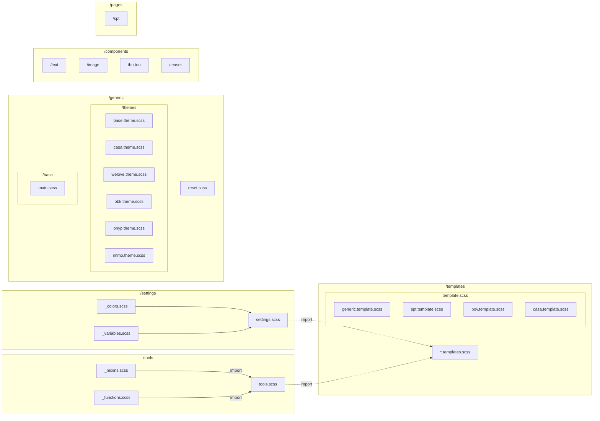

## Proposed folder structure

```mermaid
graph LR
  subgraph /settings
    _colors.scss
    _variables.scss
    settings.scss
      _colors.scss --> settings.scss
      _variables.scss --> settings.scss
  end

  subgraph /tools
    _mixins.scss
    _functions.scss
    tools.scss
      _mixins.scss --> |import| tools.scss
      _functions.scss --> |import| tools.scss
  end

  subgraph /generic
    subgraph /themes
      base.theme.scss
      casa.theme.scss
      welove.theme.scss
      obk.theme.scss
      ohyp.theme.scss
      immo.theme.scss
    end

    subgraph /base
      main.scss
    end

    reset.scss
  end

  subgraph /components
    /text
    /image
    /button
    /teaser
  end

  subgraph /templates
    template[*.templates.scss]
    subgraph template.scss
      generic.template.scss
      spt.template.scss
      pov.template.scss
      casa.template.scss
    end
  end

  subgraph /pages
    /spt
  end

  settings.scss -.-> |import| template
  tools.scss -.-> |import| template
```

### Rules

- templates control the imported components same as in template policies